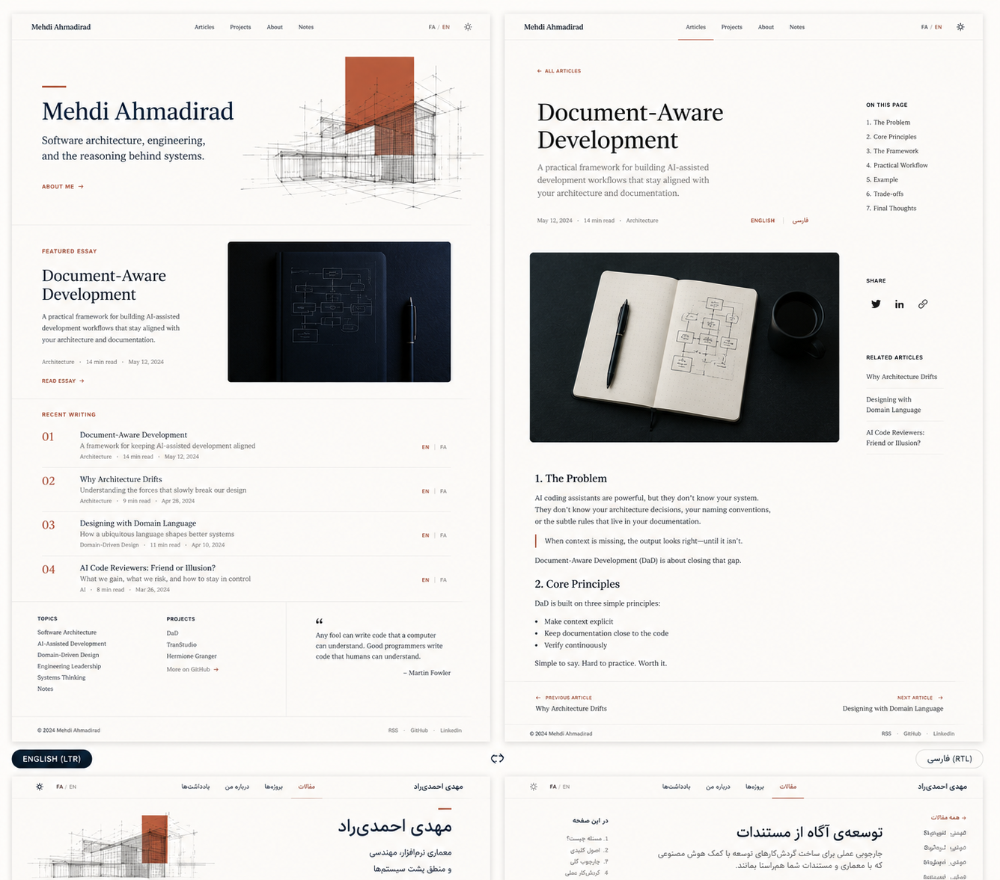

# Mehdi Ahmadirad Blog — DaD Build Pack

This package is the implementation reference for the personal, bilingual blog of **Mehdi Ahmadirad / مهدی احمدی‌راد** at `https://mehdiahmadirad.me`. It follows Document-Aware Development (DaD), enabling an AI Agent to follow decisions, specifications and implementation tasks without guessing.

## Package status

| Item | Decision |
|---|---|
| Brand | `Mehdi Ahmadirad` / `مهدی احمدی‌راد` |
| Product | The author's personal blog and professional home |
| Language | Persian and English, equal and independent |
| Direction | Genuine RTL for Persian and LTR for English |
| Visual language | **Engineering Editorial** |
| Iranian identity | Subtle, expressed through typography, geometry, rhythm and locale details |
| Graphics | Abstract and software-native, without building-architecture metaphors |
| Palette | Warm off-white, navy, brick and restrained lapis |
| Repository architecture | A public repository including source, articles, documentation and assets |
| Stack | Astro, TypeScript, Markdown/MDX, custom CSS, SVG, Pagefind, Playwright |
| Release | GitHub Actions → GitHub Pages |
| Domain | `mehdiahmadirad.me` |

## Quick Start Agent

1. First read [AGENTS.md](AGENTS.md) completely.
2. Follow [PROJECT-BOOTSTRAP.md](PROJECT-BOOTSTRAP.md) to create or adapt the repository.
3. Follow the rules of [IMPLEMENTATION-PROTOCOL.md](IMPLEMENTATION-PROTOCOL.md) and [DOCUMENTATION-CONVENTIONS.md](DOCUMENTATION-CONVENTIONS.md).
4. Read accepted ADRs and then SPECs.
5. Execute only the next ready TASK; do not open multiple phases at once.

## Document map

```text
README.md
AGENTS.md
PROJECT-BOOTSTRAP.md
IMPLEMENTATION-PROTOCOL.md
DOCUMENTATION-CONVENTIONS.md
assets/
  design-reference.png
docs/
  adr/       architecture and product decisions
  specs/     testable specifications
  tasks/     bounded, phased work
```

## Reference image



This image is the reference for **composition, hierarchy, proportions, white space, rules and color accents**. Its lower section, which shows Persian views, is cropped and therefore is not a complete reference for Persian details. The Persian implementation must follow the SPECs and full-viewport testing.

The building-architecture sketches in the image are not approved content. Only their position and visual weight may be reused; replace them with abstract, software-native SVG using nodes, edges, dependencies, states, modules and flows.

## Priority of resources during conflict

1. New and explicit request of the product owner
2. ADR with status `accepted`
3. Related specialized SPEC
4. TASK active
5. Design tokens
6. Reference image
7. Tool defaults or Agent preference

For an unresolved conflict, the Agent must stop according to the applicable stop condition and must not conceal the disagreement through implementation.

## The principle of traceability

Each change must maintain this chain:

```text
Intent → ADR → SPEC → TASK → Code/Test/Evidence
```

Changing the decision without ADR, implementing functionality without SPEC, or closing TASK without evidence is not accepted.

## The expected output of the actual repository

```text
.
├── .github/workflows/
├── docs/
├── public/
├── src/
│   ├── components/
│   ├── content/
│   ├── i18n/
│   ├── layouts/
│   ├── pages/
│   └── styles/
├── tests/
├── AGENTS.md
├── astro.config.mjs
├── package.json
├── playwright.config.ts
└── tsconfig.json
```

This repository intentionally retains both the “reasons for building” and the “things built.” Public CSS, templates and articles are not an architectural risk for this blog; secrets, private drafts and license-restricted assets must not be committed.
